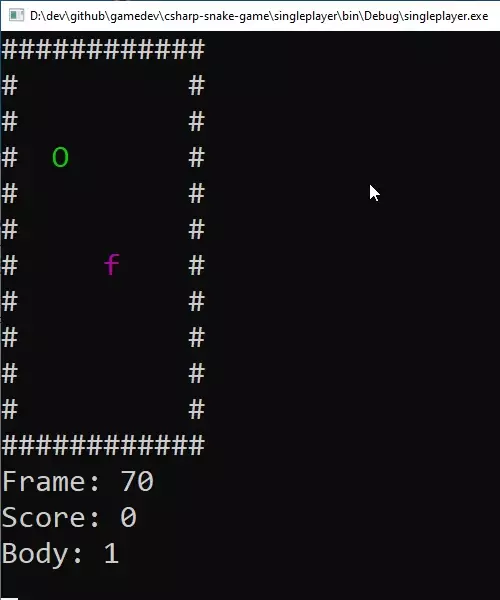

# csharp-snake-game
 
## Description

Legendary snake game :apple: :snake:

## How to

Use arrow keys (<kbd>&#8592;</kbd>, <kbd>&#8593;</kbd>, <kbd>&#8594;</kbd>, <kbd>&#8595;</kbd>) to change direction of the snake, <kbd>Spacebar</kbd> to immediately grow in size

## Features

- Only single-player mode is available at the moment
- Networking stuff coming soon (**WIP**) — play with friends or other peoples across the world

## Todo

- [ ] It's not to late for **TDD**
- [ ] Websocket server to handle cross-platform clients
- [ ] Find out how to render emoji properly (instead of using plain symbols)
- [ ] Multiple game modes (e.g., labyrinth, closed room — not only endless room)

## Showcase

<table>
  <tr>
    <td>
      
    </td>
  </tr>
</table>
